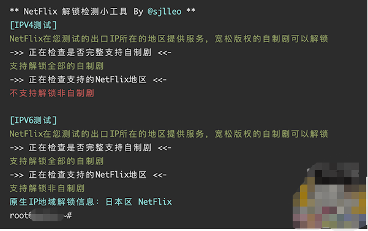

#### Netflix 解锁检测脚本

------------


运行以下代码，即可查询自己的 VPS 是否支持奈飞全解锁或是半解锁！

<br>

> 奈飞 (Netflix) 解锁，分为自制剧解锁、非自制剧解锁、或是直接打不开奈飞 (Netflix) 页面。一般来说，电影上面有 N 符号，或是电影开始有 Netflix 标识的可认定为奈飞(Netflix) 的自制剧，其他的片源为奈飞(Netflix) 的非自制剧。非自制剧 ≥ 自制剧 ＞ 看不了 … … 一般情况下，解锁了奈飞 (Netflix) 的非自制剧，所有的电影也就都能看了（当然，奈飞(Netflix) 的片源是分区的，解锁相应的地区就会有相应的电影）


<br>


```shell
wget -O nf https://github.com/sjlleo/netflix-verify/releases/download/2.01/nf_2.01_linux_amd64 && chmod +x nf && clear && ./nf
```

<br>



