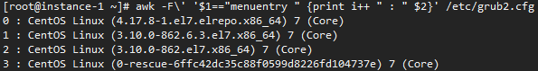
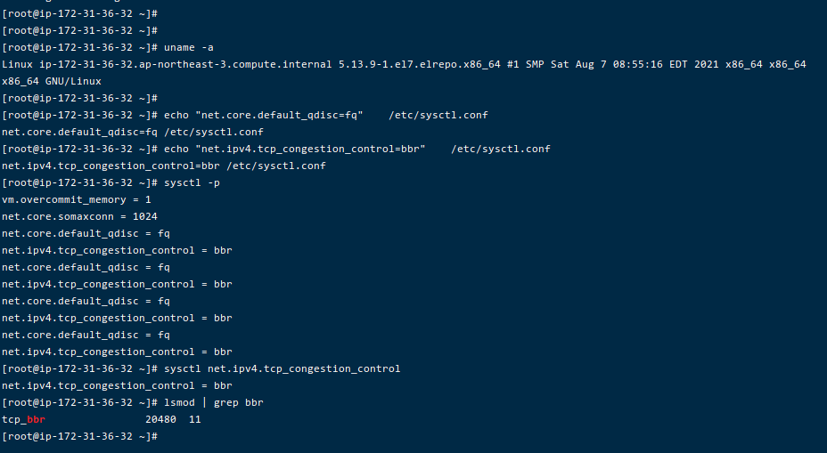

#### 开启bbr 可以让节点速度更加奔放，他们都这样说的

----------

?> 打算开启bbr的我，看到了有很多什么bbrplus、魔改版bbr一键脚本，表示不放心，尽量不用就不用，自己升级内核安装原版bbr叭

----

**环境：CentOS7**


BBR这项新功能是在kernel4.9中加入的，而CentOS都还停留在2.x的内核，所以要给CentOS装BBR第一件事就是想办法装上高版本的内核。

那么我们首先安装elrepo源：

```shell
rpm --import https://www.elrepo.org/RPM-GPG-KEY-elrepo.org
rpm -Uvh http://www.elrepo.org/elrepo-release-7.0-3.el7.elrepo.noarch.rpm
```


安装yum-utils：

```shell
yum -y install yum-utils
```


启用elrepo–kernel

```shell
yum-config-manager --enable elrepo-kernel
```

安装elrepo内的最新内核：
```shell
yum -y install kernel-ml kernel-ml-devel
```


完成之后，一般情况下，新安装的内核就应该已经在grub2的0号启动位了，不过为了以防万一，还是自己执行下面的命令手动查看一番：

```shell
awk -F\' '$1=="menuentry " {print i++ " : " $2}' /etc/grub2.cfg
```

如图所示的回显，4.x的内核就是我们刚新安装上的内核了，确实是在0号：




接下来设置grub2默认的启动项为0，如果你的4.x内核启动编号不是0就把下面命令的0改成对应你自己的：

```shell
grub2-set-default 0
```


然后直接重启机器：

```shell
reboot
```

如果内核更换成功并且grub2启动没问题的话，稍等片刻机器就能重新开机，但如果哪个地方出了问题可能就挂掉了，此时你只能通过VNC或者IPMI检查。也有可能会出现重启之后内核没有更换成功的问题，这就要自己检查了。


--------------





在系统重启之后先看下内核是否更换成功：

```shell
uname -a
```


返回4.x的内核信息就说明更换成功：

所以接下来就是开启BBR了，直接依次执行下面的三条命令即可完成开启BBR的操作：

```shell
echo "net.core.default_qdisc=fq"    /etc/sysctl.conf
echo "net.ipv4.tcp_congestion_control=bbr"    /etc/sysctl.conf
sysctl -p
```

最后验证BBR是否启用成功：

```shell
sysctl net.ipv4.tcp_congestion_control
lsmod | grep bbr
```


<br>


<br>


<br>

?> 至此，  完成。


<br>


<br>


<br>

-------

<p align="right">最近更新： {docsify-updated}</p>
